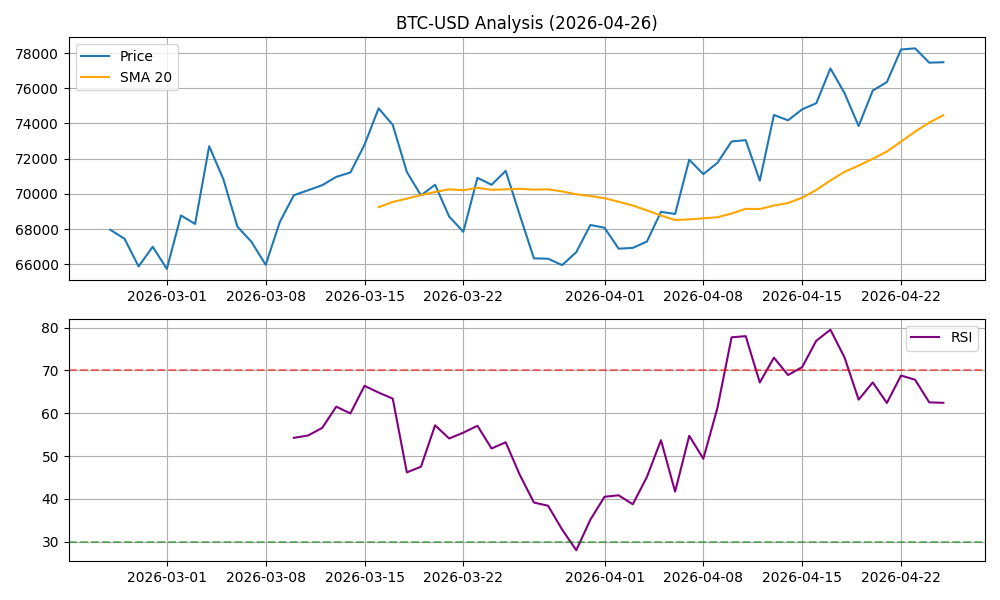

# 🤖 Advanced Engineering Automation Dashboard

**Auto-generated Report** | Last Updated: 2026-01-01 06:22:20

## 📊 Market Pulse (CryptoAnalyst)
> 2026-01-01 06:19:28.859425: BTC $87598.21 | RSI: 58.04

## 📰 Tech Sentiment (NewsPulse)
## 2026-01-01
- **Tech Mood**: Positive 📈 (Score: 0.08)
- **Top Story**: The Delete Act
- **Sample**: _Warren Buffett steps down as Berkshire Hathaway CEO after six decades_

---
*This repository is maintained by an autonomous Python agent performing daily data science and NLP tasks.*
