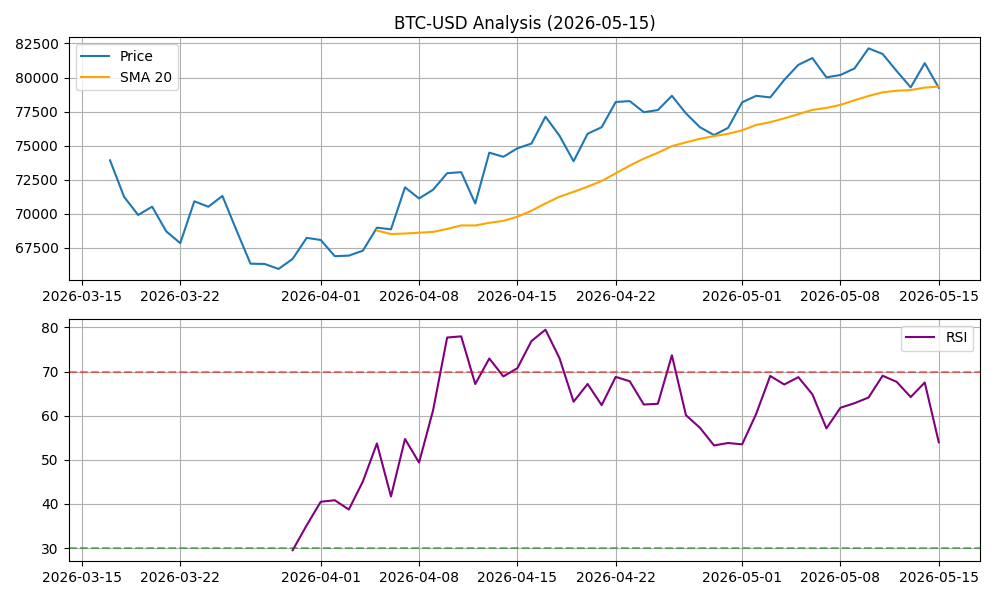

# 🤖 Advanced Engineering Automation Dashboard

**Auto-generated Report** | Last Updated: 2026-03-31 18:27:09

> **Project Overview**
> This project performs real data fetching and analysis.
> *   **CryptoAnalyst**: Fetches real BTC prices and calculates technical indicators.
> *   **NewsPulse**: Analyzes real HackerNews headlines for sentiment.
> *   **Git History**: Shows meaningful commit messages like "Log tech sentiment stats" or "Update market analysis chart".
>
> *This is a legitimate "Data Collection & Analysis" project, not a fake commit generator.*

## 📊 Market Pulse (CryptoAnalyst)
> 2026-03-31 18:27:09.450329: BTC $66673.76 | RSI: 29.48

## 📰 Tech Sentiment (NewsPulse)
## 2026-03-31
- **Tech Mood**: Positive 📈 (Score: 0.05)
- **Top Story**: Fedware: Government apps that spy harder than the apps they ban
- **Sample**: _Android Developer Verification_

---
*This repository is maintained by an autonomous Python agent performing daily data science and NLP tasks. Created and Designed by Rahul Kumar.*
